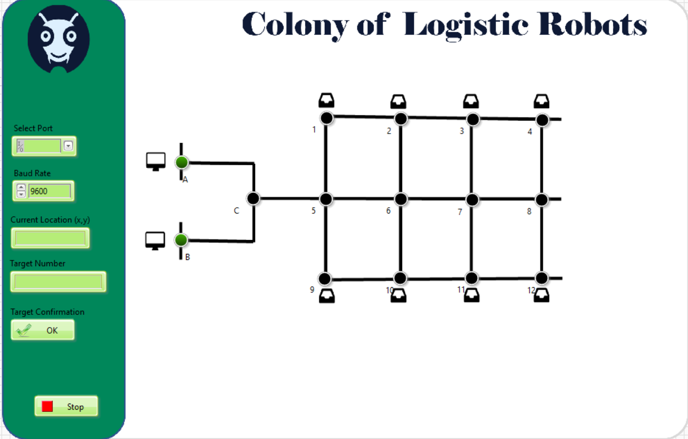

  

<h1 align="center">AGV</h1>

---
### GUI Progress
SW tools used: [LabView ](https://www.ni.com/en-lb/support/downloads/software-products/download.labview.html#411240)

***Responsibilities***: Create an interactive graphical user interface used to control AGV destination and show the current position at real time.

***Progress***: can be found in file [guiTasks.xlsx](https://github.com/CLR-2021/agv-gui/blob/master/guiTasks.xlsx)

*Featured image:*

  

---
## All Project
For detailed information about: 
* Vision
* Team Hierarchy
* Future Work
* Working of other technical teams  
* Licenses of the project
* Sponsorship

Check this readme page for detailed information about the project: [agv-documents](https://github.com/CLR-2021/agv-documents)
